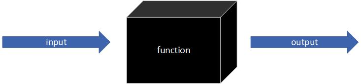

在python中，到处可见函数的身影

使用函数，最大的好处是复用代码，这一点对于编程很重要

如此重要的复用代码是什么意思呢？

假设现在有一个需求，系统的很多地方会产生dict类型的数据，这些数据需要写入到文件中方便查阅

很自然的，你不可能每个地方都写一遍“将dict类型数据写入文件”的代码，哪怕是一式多份的复制也会让人头疼不已

我们比较合理的做法是：把“将dict类型数据写入文件”的实现放到一个函数中，在需要的地方直接调用即可，调用的人不用关心函数的实现逻辑

函数看起来会像下图这样：



# 函数定义

在python中，如何定义一个函数呢？基本语法如下：

```
def function_name(args):
    # function body here

```

函数有几个部分组成：
* def关键字开始函数的定义
* 紧接着是函数名
* 然后是参数列表
* 最后是函数体：**特别注意：python是以缩进决定代码层次的，所以函数体一定比```def function_name()```行缩进几个空格，一般四个**

## 函数名
函数名可以包含字母、数字、下划线，如果函数名由多个单词组成，使用下划线```_```连接，示例：
```
def first_name(name):
    return name.split()[0]
```
一般情况下（非强制，约定）：
* 双下划线```__```开头的函数为系统保留函数
* 单下划线```_```开头的函数为私有函数

## 函数参数
### 位置参数
在定义函数时，只有参数名字，我们来看一个示例：
```
def hello(name, age):
    # function body here

```

### 关键字参数
在定义函数时，包含参数名和一个默认值，我们来看一个示例：
```
def bye(name="Jack"):
    # function body here
```

### 任意参数
任意参数比较特殊，如下：
```
def arg_print(*args, **kwargs):
    # function body here
```

## 函数体
函数体接收参数进行处理并返回输出，我们按照参数类型来给出函数体，展示不同类型参数的使用：
### 位置参数
```
def hello(name, age):
    print("Hello, my name is {}, {} years old".format(name, age))
```
在函数体中，参数可以看成一个变量，使用时直接引用变量名

### 关键字参数
```
def bye(name="Jack"):
    print("Bye, {}".format(name))
```
使用方式同位置参数

### 任意参数
```
def arg_print(*args, **kwargs):
    print("There are {} position args: {}, and {} kwargs: {}".format(len(args), args, len(kwargs), kwargs))
```
* ```*args```：是一个tuple，所有tuple具备的方法它都具备，比如计算元素个数、取出某个元素、遍历所有元素等
* ```**kwargs```：是一个dict，所有dict具备的方法它都具备，比如计算元素个数、取某个key对应的value等

### 返回值
函数通过```return```返回值给调用者，一个函数如果没写```return```或者只写一个空的```return```，则返回值为```None```

```return```可以返回任意类型数据，还可以“返回多个数据”（实际是tuple）

# 函数调用
上面定义了三种参数类型的函数，我们现在来调用
## 位置参数
```
hello("Jack", 23)
hello(name="Jack", age=23)
hello(age=23, name="Jack")
```

调用结果：
```
Hello, my name is Jack, 23 years old
Hello, my name is Jack, 23 years old
Hello, my name is Jack, 23 years old
```

说明：
* 可以按照函数定义时参数的顺序，逐个传值（示例1），也可以指定参数名传值（示例2/3）
* 每一个位置参数都必须传值，如下调用都是错误的：
```
hello("Tom")
hello(name="Tom")
hello(23)
hello(age=23)
```

会得到类似下面的错误：
```
Traceback (most recent call last):
  File "D:/GitHub/HelloWorld/hello.py", line 16, in <module>
    hello("Tom")
TypeError: hello() missing 1 required positional argument: 'age'
```

## 关键字参数
```
bye()
bye("Tom")
bye(name="Tom")
```

调用结果：
```
Bye, Jack
Bye, Jack
Bye, Jack
```

说明：
* 可以不传值（示例1），使用默认值；按照函数定义时参数的顺序，逐个传值（示例2）；也可以指定参数名传值（示例3）
* 指定参数名传值没有顺序要求

## 任意参数
```
arg_print("Jack", 23, height=178, weight=139, hobby="game")
```

调用结果：
```
There are 2 position args: ('Jack', 23), and 3 kwargs: {'height': 178, 'weight': 139, 'hobby': 'game'}
```

## 返回值
```
def default():
    pass


def default_return():
    return


def rel_return():
    return "Jack"

print(default())
print(default_return())
print(rel_return())
```

运行结果：
```
None
None
Jack
```

# 其他说明
* 如果函数有多种类型的参数：位置参数、关键字参数、任意参数。顺序必须是：```**kwargs```必须最后出现
