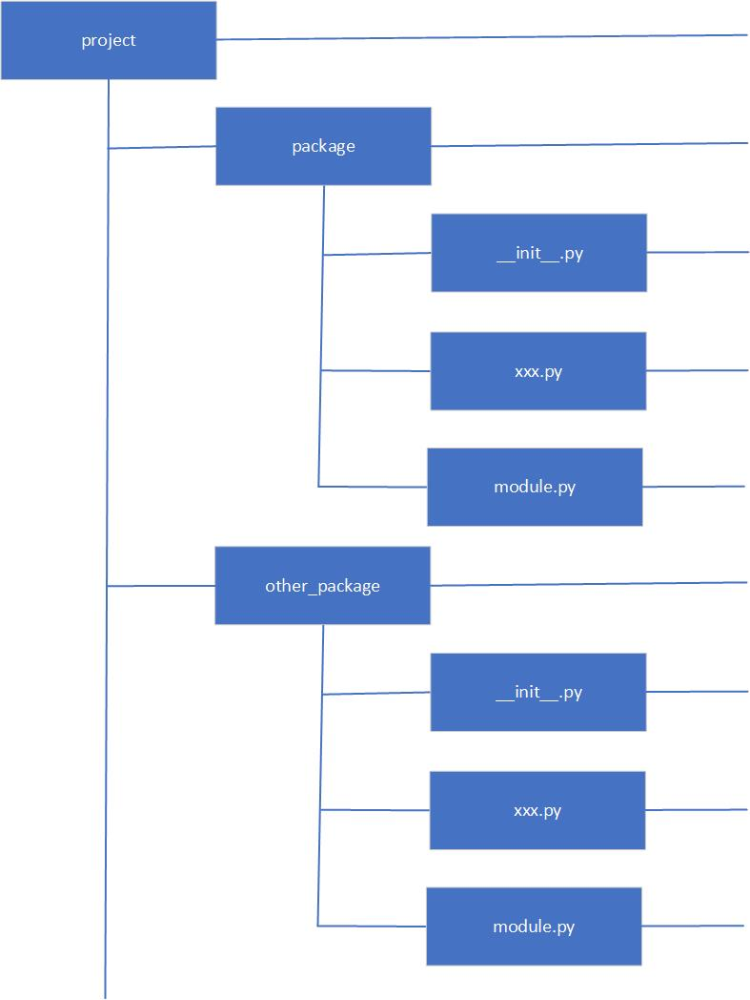

对于使用程序的人来讲，程序就是一个魔术盒，对程序员来讲，程序的结构如下：



一个python project包含：
* package
* module

# package
python package： 是一个文件夹，文件夹中包含一个`__init__.py`，任意数量的`.py`文件。一般会将相关性很强的多个`.py`文件放到一起组成一个package

一个python project可以包含多个package，package还可以嵌套（package中包含package）

# module
python module：是一个文件，文件一般以`.py`结尾，文件中是python代码

一个python可以包含任意数量的module，但module也可以脱离package单独存在

module中的代码包括但不仅限于：
* 变量
* 数据类型
* 函数
* 类

这些都将在后面的文章中详细讲解，此处暂不展开

module中的代码又会有多级，看起来像这样：
```
def say_hello(name):
    print("Hello, {}".format(name))


def say_bye(name):
    print("Bye, {}".format(name))


if __name__ == "__main__":
    say_hello("Jack")
    say_bye("Jack")
```

在最上级的是：
* `def say_hello(name)`
* `def say_bye(name)`
* `if __name__ == "__main__"`

当module被执行或别的模块使用时会执行最上级的代码

再下一级的:
* `print("Hello, {}".format(name))`
* `print("Bye, {}".format(name))`

只要函数`say_hello`，`say_bye`被调用的时候才会执行
