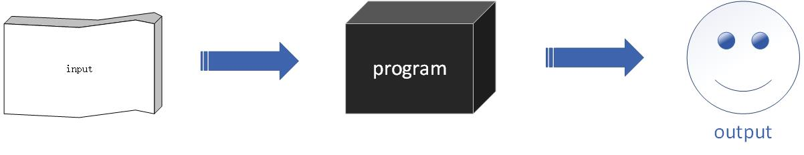
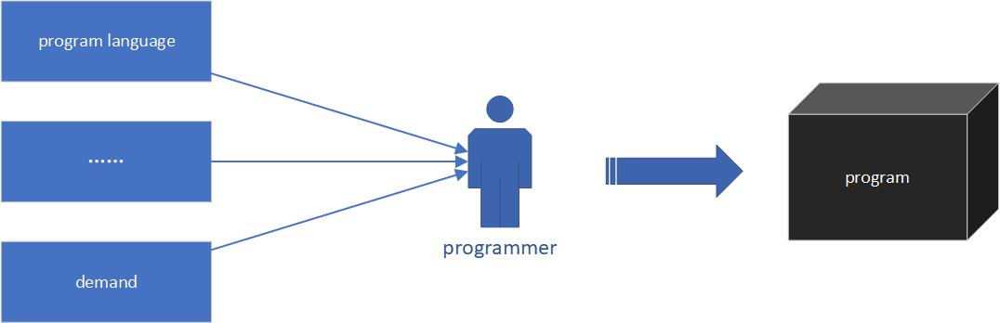

程序员是一群神奇的人，他们充满了魔力，用他们的智慧和灵活的双手，编织了一个又一个的魔术盒，经过了魔术盒的物品变成了人们想要的另外的物品

看起来大概像下面这样：

看着这张图思索良久，突然间觉得这个世界充满了程序：
* 泥土是程序，因为你把种子、适当的雨水、肥料给它，他就能给你花草和树木
* 电水壶是程序，因为你把水、电给它，他就能给你白开水
* ......
* 甚至，连程序员都是程序

世间万物，都像一个魔术盒，将输入转换成输出，输入、转换、输出，构成了万物的三个维度，奇妙至极

程序也是如此，输入、转换、输出，一应俱全

输入：
* 键盘/鼠标输入
* 传感器输入
* 文件输入
* 网络输入等等

转换：
* 合并
* 剔除无用数字等等

输出：
* 数字
* 网页
* 视音频等等

万丈高楼平地起，只要基础打得牢，万丈高楼，迟早的事......
