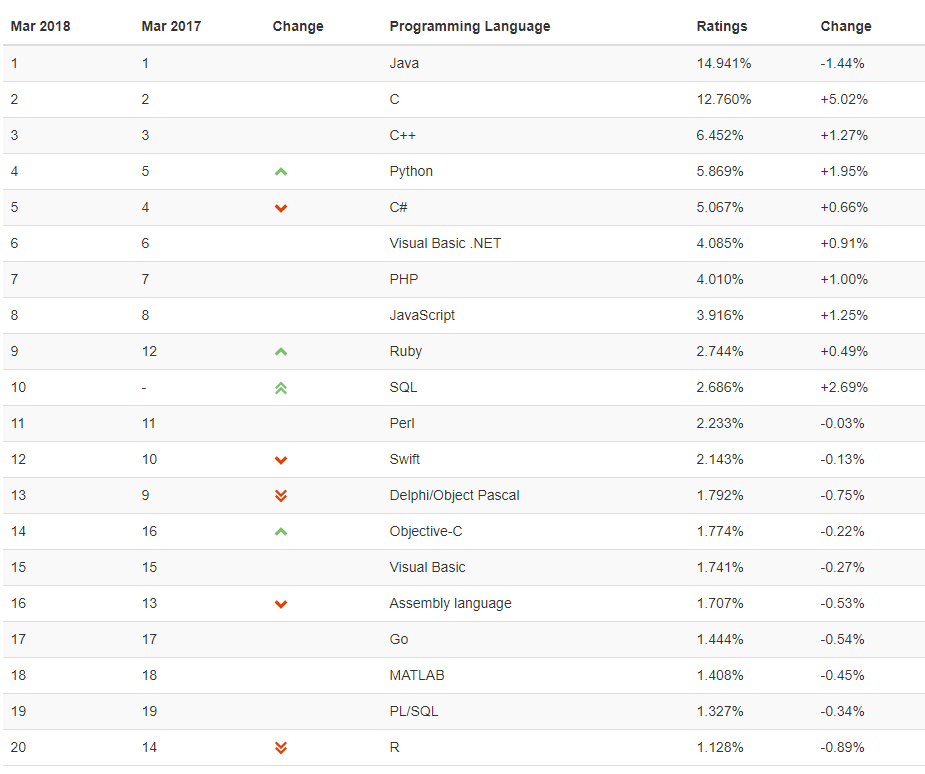

提到python，你首先想到的会是什么？

**超喜欢的一种编程语言**，让我们一起来看看大家是怎么看待python的呢？

# 业界

## 编程语言排行榜

TIOBE发布2018年3月编程语言排行榜数据(前十名，[原文出处](https://www.tiobe.com/tiobe-index//))：

再看另外一张图：

不少开发人员总是会拿python跟C、C++等去比性能，[安迪比尔定理](https://baike.baidu.com/item/%E5%AE%89%E8%BF%AA%E6%AF%94%E5%B0%94%E5%AE%9A%E7%90%86)中提到：硬件提高的性能，很快被软件消耗掉了。是被谁消耗掉了呢？应该是被像python一样易于开发但性能不是特别好的程序设计语言消耗掉了吧？我甚至觉得这样的语言会越来越流行。因为随着技术的发展，硬件成本变得越来越低廉，人力成本却不断增加，在大多数场景中，人们更加倾向于升级硬件来提升性能，这样一来，编程语言构建应用的效率越来越被看重

# 社区
一门编程语言想要获得成功，至少需要满足几个条件：
1. 从设计上，应该是一个核心外加诸多的扩展库
2. 一定要易于使用。满足这前两个条件，就会有开发者使用该编程语言去编写一些第三方库
3. 只要核心加上一些第三方库可以解决一系列的基本问题之后，才会有更多的人使用这门编程语言，这本身可以提升其知名度和粘性
3. 有了这些之后就有了社区，社区的力量超乎你的想象

云计算，就算不懂计算机也知道是这几年火的一塌糊涂的技术了吧，最大的开源公有云/私有云社区Openstack几乎所有的项目可都是python实现的

著名的web框架django

github上[各编程语言项目数量](https://github.com/search/advanced)：

随着边缘计算，物联网的发展，python很可能运行在你身边的每一个可见设备上，为你带来优质的服务

# 大众接受
要谈python的大众接受程度，我觉得从某些网站上的博客和帖子可见一斑：

* [Python薪资又涨了，这可咋办啊！](https://blog.csdn.net/qq_36510261/article/details/78676494)
* [教女朋友学 Python 是一种什么体验？](https://www.zhihu.com/question/56366837)
* [Python不能帮你找到女朋友，却能让你成为有钱的单身狗](https://blog.csdn.net/bf02jgtrs00xktcx/article/details/78852781)
* [教女朋友学python](https://blog.csdn.net/zxhm001/article/category/6556406)

看完这些，我瞬间觉得：学了python可以教妹子，工资还高，这不就是程序员最头疼的两大问题吗？学会python可都解决了

**这就是：世界上最好的语言，还有谁不服？**
