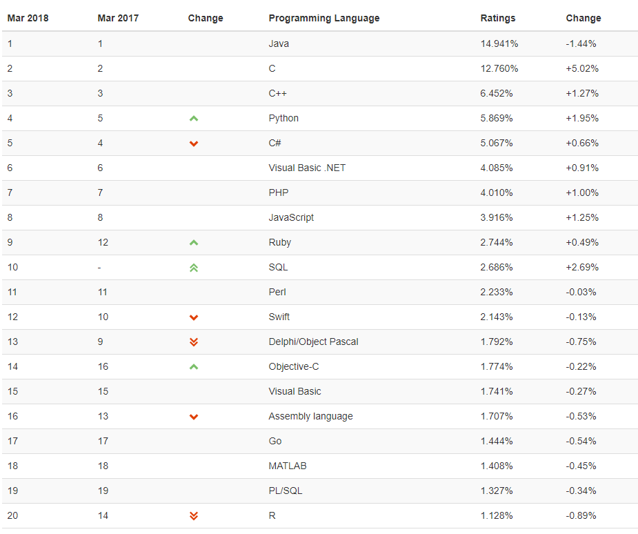
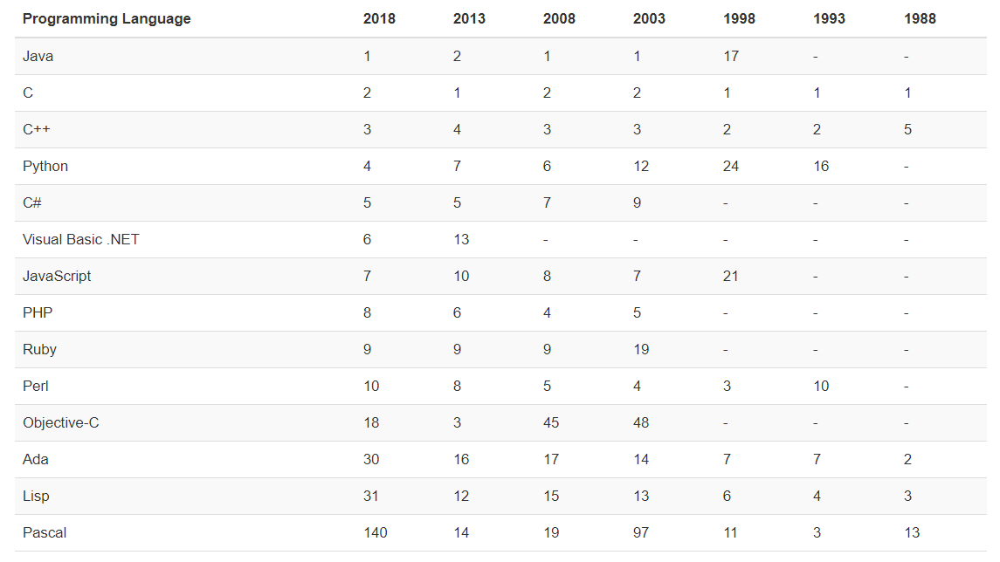

提到python，你首先想到的会是什么？

**超喜欢的一种编程语言**，让我们一起来看看大家是怎么看待python的呢？

TIOBE发布2018年3月编程语言排行榜数据(前十名，[原文出处](https://www.tiobe.com/tiobe-index//))：

再看另外一张图：

随着云计算、数据分析的崛起，python一路高歌猛进

[安迪比尔定理](https://baike.baidu.com/item/%E5%AE%89%E8%BF%AA%E6%AF%94%E5%B0%94%E5%AE%9A%E7%90%86)指出：硬件提高的性能，很快被软件消耗掉了。随着技术的发展，硬件成本变得越来越低廉，人力成本却不断飙升，在大多数场景中，人们更加倾向于升级硬件来提升性能，这样一来，编程语言构建应用的效率越来越被看重。
